# ImageLab — Assessment 1: Week 4
## Manual testing and measurement report

Student: Daryn Forman
Testing date: 27 September 2026
Branch: week4
Method: manual browser testing, curl requests, PostgreSQL inspection, and exported Firefox HAR files. No added browser automation was used for these reported results.

## 1. Purpose and architecture

The API validates and stores an original, commits image and queued-job records, then returns 202 Accepted with the job URL. One worker performs transformations independently. PostgreSQL owns authoritative status and timestamps. The browser retrieves that status approximately every second until completed or failed.

Images and jobs use internal UUID v7 keys and separate unique public UUID v4 identifiers. URLs and API responses use public identifiers; database relationships use internal keys. Variants are addressed publicly by image and profile name.

## 2. Recorded manual checks

| Check | Outcome | Evidence and limits |
|---|---|---|
| Initial page | Observed | No selected image, no active job, empty results, empty Network list; screenshots 1–2. Disabled-button interaction not separately confirmed. |
| Local preview | Observed | Filename, size, type and preview appear with no recorded POST/status GET; screenshot 2. |
| Upload acknowledgement | Observed | Earlier Network capture shows 202; separate acceptance JSON and Location screenshots show required fields. These are different jobs and are not treated as one trace. Measurement HARs also contain 202 responses. |
| Active processing | Observed | Upload/original steps Done, generation In progress, completion Pending; screenshot 3. |
| Completion and variants | Observed | Completed timeline and variants; screenshots 4, 7 and 9. Large-image outputs: 150×150, 800×533, 1200×800. Small image: 150×150, 148×147, 148×147. |
| View and Download | User-confirmed pass | Both controls worked during the manual test. |
| Polling and terminal stop | Observed | Repeated status GETs and UI stopped indicator; HARs end status polling after completed and then load images. This does not prove indefinite absence of later requests. |
| Retrieval failure | Observed | Offline GET, last-known processing state preserved, Unable to check status and Try again; screenshot 8. |
| Try again | Observed pass | Same job completes; trace has one original POST, failed offline GET, successful retry GET and variant GETs, with no second POST; screenshots 9–10. |
| Worker failure | Observed pass | New test original removed during 30-second delay; safe error, failed timestamp, pending completion, no results; screenshot 11. |
| Durable failure record | Observed | make db-failures shows failed state, matching failure time and safe message; screenshot 12. Its internal ID differs from the UI public ID by design. |
| Missing image rejection | Observed pass | curl returns 400 and image file is required; screenshot 13. |
| Unsupported type rejection | Observed | README.md upload returns 400; response body is cropped in screenshot 14. |
| Oversized rejection | Observed pass | 11 MiB upload returns final 400; separately supplied response text says image must not exceed 10 MB. Intermediate 100 Continue is not acceptance. |
| One-image measurements | Complete | All six metrics extracted from single-image.har and confirmed against SQL timings. |
| Five-job measurements | Complete, qualified | Five separate completed jobs submitted over 13.083 seconds; later queue waits increase; processing intervals do not overlap. |

## 3. Measurements

| Run | Ack ms | Queue ms | Processing ms | Job ms | GETs | Detection ms |
|---|---:|---:|---:|---:|---:|---:|
| Single | 1,064.00 | 994.95 | 6,201.43 | 7,196.38 | 5 | 280.50 |
| Burst 1 | 1,820.00 | 428.66 | 7,309.67 | 7,738.34 | 5 | 59.24 |
| Burst 2 | 73.00 | 5,087.93 | 5,098.28 | 10,186.21 | 5 | 494.01 |
| Burst 3 | 923.00 | 6,478.98 | 9,343.67 | 15,822.65 | 11 | 2,427.61 |
| Burst 4 | 739.00 | 12,869.90 | 6,144.36 | 19,014.26 | 12 | 6.02 |
| Burst 5 | 36.00 | 16,800.34 | 5,249.93 | 22,050.27 | 15 | 536.14 |

All values are milliseconds except GET count. The normal measurement runs include a configured five-second worker delay. The induced worker-failure demonstration used a separate 30-second delay and is not included in this table.

Acknowledgement is measured through POST response completion. Server durations use PostgreSQL timestamps from responses. Detection uses HAR response-end time as an approximation of client observation, not UI paint time. The source IDs, timestamps and request counts are recorded in docs/manual-evidence/measurements.json.

The five-tab submissions were manually staggered over 13.083 seconds. The first job could finish before all five were submitted, but multiple jobs still queued. This demonstrates queueing without claiming simultaneous submission.

## 4. Interpretation and technical reflection

202 allows acknowledgement before transformations finish. It does not remove upload, validation, disk or database time and does not reduce image-processing work. The single-image acknowledgement was 1,064 ms, while queued-to-completed duration was 7,196.38 ms. These durations begin at different boundaries and should not be subtracted as if they shared a start time.

One worker processes jobs sequentially. The burst queue waits increased from 428.66 ms to 16,800.34 ms. Processing durations varied because these were manual runs on a local virtual machine, not a controlled throughput benchmark. The timestamp intervals show that no two measured burst jobs processed simultaneously.

Polling trades repeated requests for delayed awareness of completion. Longer observation usually produces more GETs, although tab scheduling can affect counts. Burst detection ranged from 6.02 ms to 2,427.61 ms. A one-second timer is not a strict maximum detection delay: browser scheduling, background tabs, request duration and host load may contribute. The evidence does not establish one specific cause for the longest delay.

A failed status GET means the browser cannot observe current state; it does not mean the worker failed. Restoring connectivity and using Try again discovered the existing completed job without a new upload. By contrast, removing a test original caused a real worker failure that PostgreSQL recorded.

The same-page submission guard does not provide backend idempotency across tabs or retries. Browser observation cancellation does not cancel durable work. Public IDs identify resources; they are not authentication.

A later push-based observation mechanism could reduce requests for unchanged state and completion-detection delay. It would not speed up the worker or remove queue wait. No such mechanism is part of this submission.

## 5. Supplemental verification — 29 September 2026

At the student's request, the remaining software checks were run using the existing tests and temporary supplemental test files. No application code or project dependencies were changed. The original manual screenshots and measurements remain the evidence for the manual runs.

PASS: all 14 frontend checks, including rapid repeated clicks, cancellation of old requests on new upload/page shutdown, late-response protection, and no-file submission prevention. These execute the real app.js with simulated DOM/timers; they are not new manual or real-browser runs. The initial disabled attribute was also checked in HTML.

PASS: Go unit and PostgreSQL integration tests, including portrait/landscape/small-image dimensions, thumbnail center crop, public IDs, durable acceptance, independent worker processing, variant downloads, and worker failure. The integration tests create and remove their own schema and temporary storage.

PASS: temporary checks submit empty, unsupported, truncated PNG, oversized and missing inputs. Each is rejected with 400; image/job counts remain zero. Multipart rejection cases also leave no stored originals.

PASS: read-only inspection confirms database status/type/name/size constraints, foreign keys and unique identifiers/profile pairs. All 63 completed variant files inspected exist and match recorded dimensions and byte sizes; their originals exist, and every completed job has three variants.

PASS: go vet. Exact execution output is saved in manual-evidence/checklist-verification.txt; database/file inspection is in manual-evidence/database-file-verification.txt.

Remaining human actions: review setup instructions and the reflection, rehearse the final explanation, and submit under the lecturer's policy. Fresh setup by another person and lecturer sign-off are not claimed. The five-tab experiment remains a manually staggered 13.083-second burst.

## 6. Screenshots and captions

The original screenshots pasted into the conversation were recovered from local conversation records. Seventeen relevant screenshots are embedded below and saved as separate PNG files under docs/manual-evidence/screenshots. These are the original captures, not recreated test results.

### Screenshot 1: Initial page

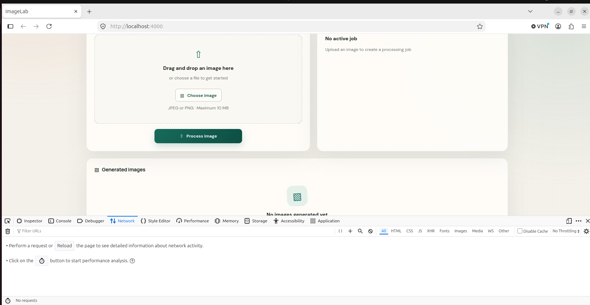

Caption: No selected image, no active job, no results, and no recorded network requests.

### Screenshot 2: Local selection

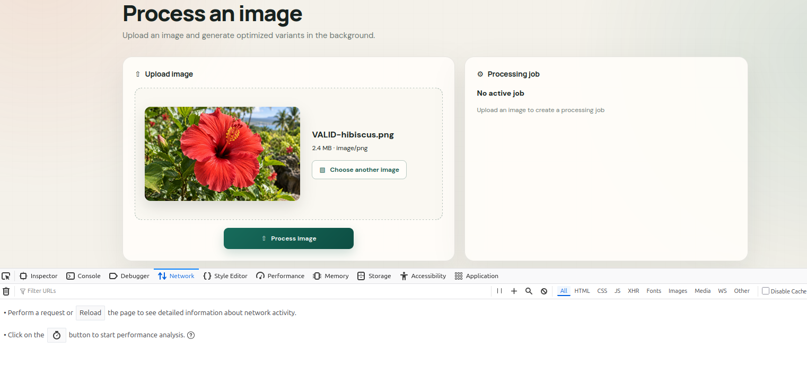

Caption: A local preview and file details appear without an upload or job-status request.

### Screenshot 3: Processing in progress

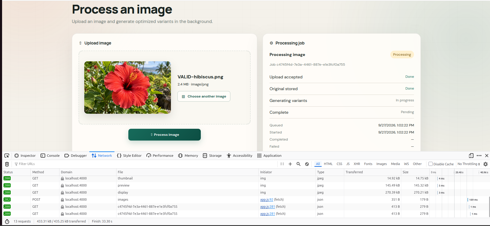

Caption: 202 acceptance and status GETs while generation is active and completion remains pending. Earlier variant requests belong to another upload.

### Screenshot 4: Completed job JSON

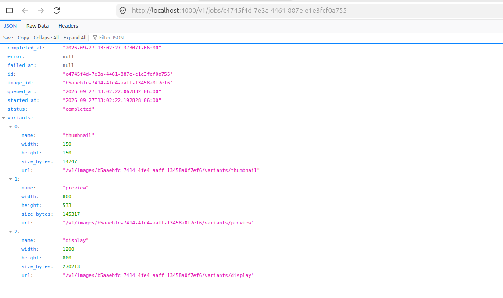

Caption: Completed status, timestamps and all three variant dimensions. This supplies evidence for the earlier hibiscus job, not the final single-image measurement run.

### Screenshot 5: Acceptance JSON

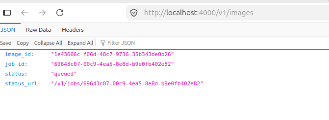

Caption: Returned image_id, job_id, queued status and status_url.

### Screenshot 6: Acceptance headers

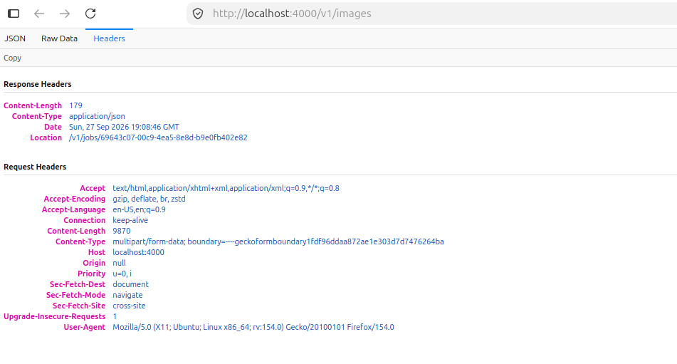

Caption: Location points to the job status resource. This screenshot does not display the HTTP status code.

### Screenshot 7: Completed small image

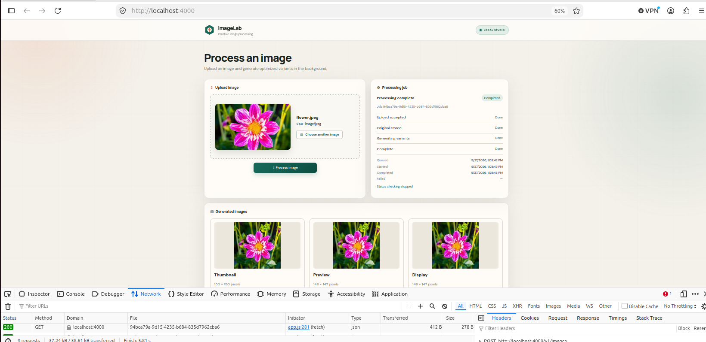

Caption: All steps complete; thumbnail 150×150 and fit variants 148×147.

### Screenshot 8: Retrieval failure

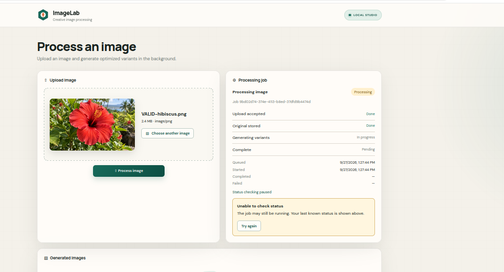

Caption: Last-known state retained with Unable to check status, paused checking and Try again.

### Screenshot 9: Recovery after retry

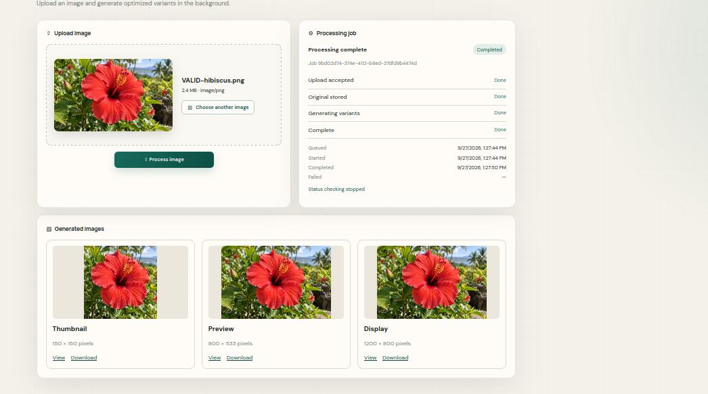

Caption: The same job is completed and all variants are visible after connectivity is restored.

### Screenshot 10: Retry Network evidence

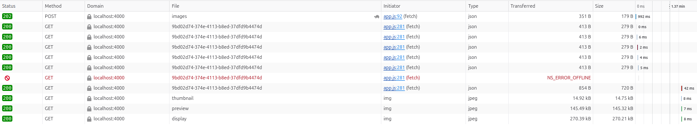

Caption: One POST, offline GET failure, successful same-job retry GET and three image requests; no second POST.

### Screenshot 11: Worker failure

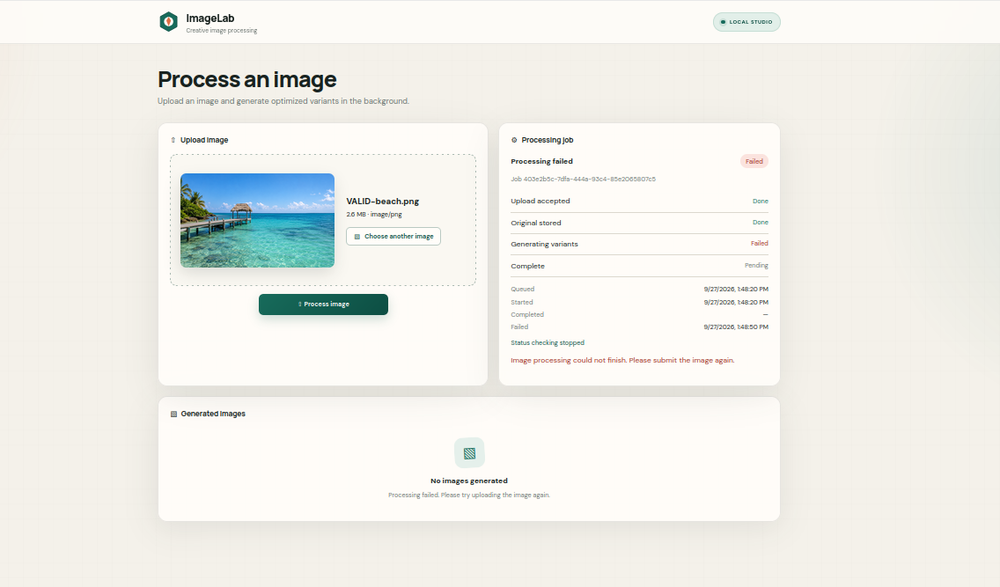

Caption: Missing test original causes failed processing, a safe error, pending completion and no results.

### Screenshot 12: Database failure record

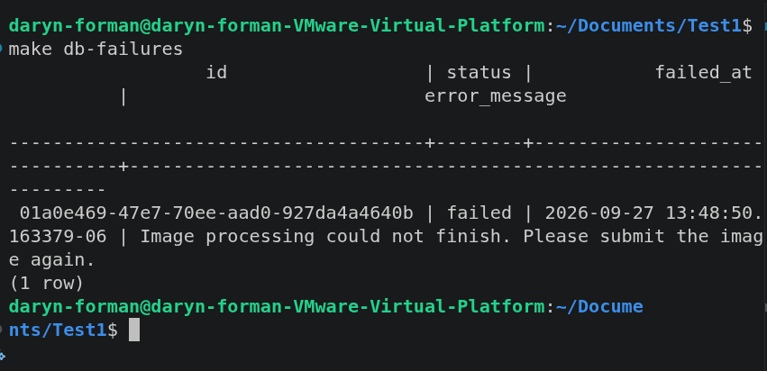

Caption: PostgreSQL persists failed status, timestamp and client-safe message.

### Screenshot 13: Missing upload

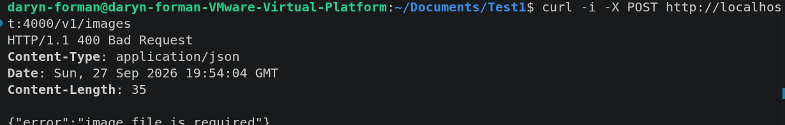

Caption: Server rejects a request without an image with HTTP 400.

### Screenshot 14: Unsupported upload

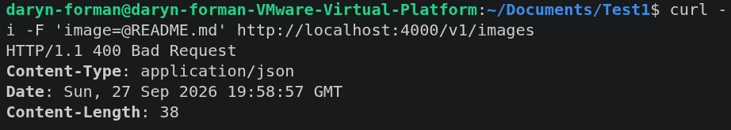

Caption: README.md submitted as an image receives HTTP 400; error body cropped.

### Screenshot 15: Oversized upload

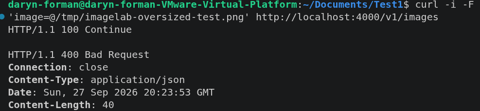

Caption: Final HTTP 400 rejects the 11 MiB file. Separate response text confirms the size error.

### Screenshot 16: Single-image completion and Network

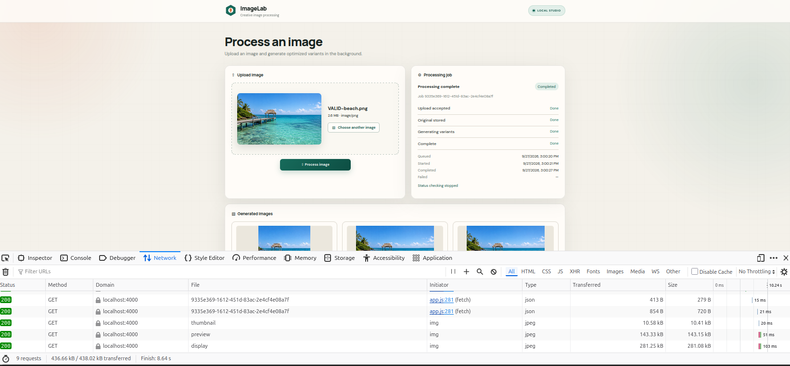

Caption: Measured beach-image job completed; screenshot contains only part of the request list, supplemented by the full HAR.

### Screenshot 17: Single-image SQL durations

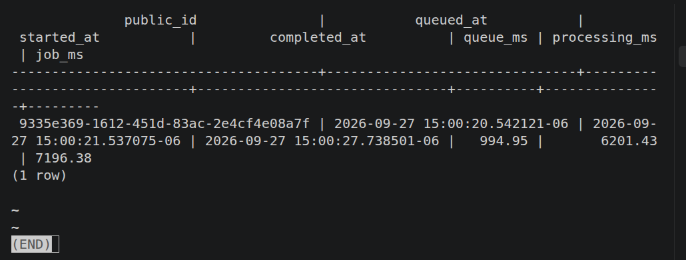

Caption: Matching public job ID with queue 994.95 ms, processing 6,201.43 ms and job duration 7,196.38 ms.

## 7. Submission contents and remaining actions

Include source and migrations from week4, README setup instructions, this report, original screenshots, and measurement evidence. Keep the original HAR files as supporting records; the repository extract intentionally excludes image-upload bodies and unrelated headers. Confirm lecturer-specific submission naming and location.

Review the verification results in section 5, then rehearse explaining the acceptance boundary, one worker, PostgreSQL state, polling, and the difference between observation failure and processing failure. The report is evidence prepared for submission, not a declaration that every acceptance item or live assessment has passed.

## Appendix A. Acceptance checklist

Checklist reviewed 29 September 2026. Items 1–16 follow the Version 1 Requirements section 16; the wording also incorporates the Four Week Brief section 13 checks for UI states, cancellation and interpretation. Item 17 records the brief's additional setup-reproducibility check.

PASS means the stated behavior is supported by the cited evidence. Manual screenshots and automated checks are distinguished; simulated browser events are not presented as manual demonstrations. The qualified burst result and unverified independent setup are retained explicitly. This checklist is not lecturer sign-off.

| No. | Acceptance check | Result | Evidence |
|---|---|---|---|
| 1 | Initial page has no image, job, results or polling. | PASS | Screenshot 1; initial-button/no-file test in section 5. |
| 2 | Selecting a file creates a local preview without a server job. | PASS | Screenshot 2; frontend selection test records no requests. |
| 3 | One click starts one POST; disabled button and isSubmitting prevent overlapping uploads. | PASS | Frontend repeated-click test; section 5. |
| 4 | The handler stores the original and queued job before returning 202. | PASS | PostgreSQL integration test verifies durable acceptance before worker start; section 5. |
| 5 | 202 includes image ID, job ID, status, status URL and Location. | PASS | Screenshots 3, 5–6 and measured HAR responses; integration contract checks. |
| 6 | The upload handler does not generate variants. | PASS | Source review and integration acceptance with worker not yet running; sections 1 and 5. |
| 7 | One background worker moves queued to processing, then completed or failed. | PASS | Screenshots 3–4 and 11–12; integration test; non-overlapping burst processing timestamps. |
| 8 | Polling begins after 202 and uses prompt GETs approximately every second. | PASS | Frontend timing tests and HAR traces. Actual timing varies with response time/browser scheduling; section 4. |
| 9 | The UI updates after successful status responses, including active, completed and failed states. | PASS | Screenshots 3, 7–9 and 11; frontend lifecycle tests. |
| 10 | Results stay hidden until all required variants are available. | PASS | Processing/failed screenshots; completed results; frontend incomplete-variant response test; metadata checks. |
| 11 | Polling stops on completed or failed. | PASS | Screenshots 7, 9 and 11; frontend terminal-stop tests; recorded HAR ends status polling after completion. |
| 12 | Retrieval errors preserve the job, stop polling and offer Try again. | PASS | Screenshot 8 and offline request in screenshot 10; frontend network/HTTP/JSON/timeout tests. |
| 13 | Try again observes the same job without resubmitting the image. | PASS | Screenshots 9–10 show same-job recovery and no second POST; frontend retry tests. |
| 14 | All three variants meet dimension and aspect-ratio contracts. | PASS | Screenshots 4, 7 and 9; portrait/landscape/small-image and center-crop tests; 63 files checked against metadata. |
| 15 | A new upload cancels previous observation; page shutdown can also cancel it. | PASS | Frontend new-upload, pagehide and late-response tests using simulated browser events; section 5. |
| 16 | Required timestamps and all six measurements are recorded and interpreted for one image and five jobs. | PASS, QUALIFIED | Sections 3–4: one-image and five-job tables. Manual five-tab submissions span 13.083 seconds; detection is estimated from network response end. |
| 17 | Another person can follow the README and run the application. | NOT INDEPENDENTLY VERIFIED | Setup instructions are documented and fresh test-schema migrations pass. A separate person has not performed a full setup. This is the additional reproducibility item in Brief section 13. |
